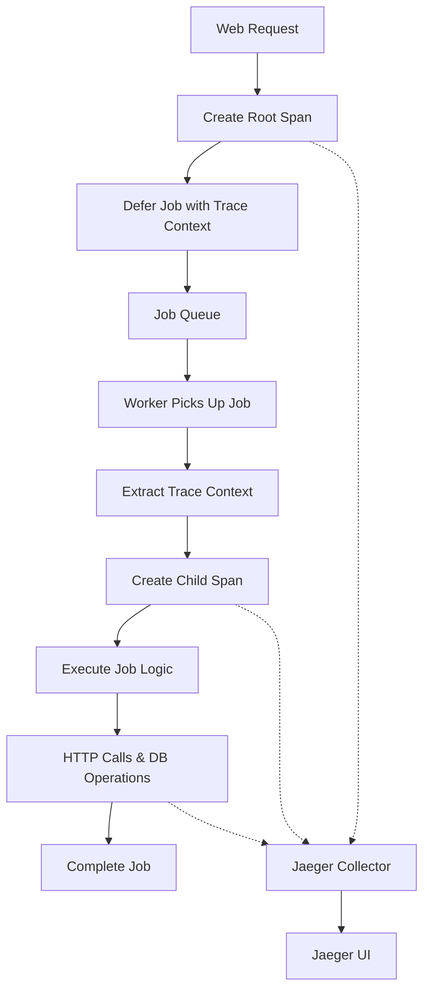

# OpenTelemetry + Procrastinate Tracing Guide

This guide demonstrates how to implement distributed tracing for Procrastinate jobs using OpenTelemetry and Jaeger.

## 🎯 What You'll Learn

- How to pass trace context through Procrastinate job arguments
- Track jobs from defer to completion across async boundaries
- Set up Jaeger for trace visualization
- Implement custom instrumentation for job workflows

## 🏗️ Architecture Overview



## 🚀 Quick Start

### 1. Install Dependencies

```bash
pip install -r requirements.txt
```

### 2. Start Infrastructure

```bash
# Start PostgreSQL and Jaeger
docker-compose up -d postgres jaeger

# Wait for services to be ready
sleep 10
```

### 3. Run Simple Example

```bash
# Terminal 1: Run the simple tracing example
python simple_tracing_example.py

# Terminal 2: Start a worker to process the jobs
procrastinate worker --queues=default
```

### 4. View Traces

1. Open Jaeger UI: http://localhost:16686
2. Select service: `simple-example`
3. Click "Find Traces"
4. Explore the trace timeline!

## 📋 Core Concepts

### Trace Context Propagation

The key to distributed tracing with Procrastinate is passing trace context as job arguments:

```python
from app.tracing import inject_trace_context, extract_trace_context

# When deferring a job
@app.task(pass_context=True)
async def my_task(context, data: str, trace_context: Optional[Dict[str, str]] = None):
    # Extract trace context to continue the trace
    if trace_context:
        extract_trace_context(trace_context)
    
    # Now you're in the same distributed trace!
    with get_tracer().start_as_current_span("my_task_execution"):
        # Your job logic here
        pass

# When deferring the job
async def defer_my_job(data: str):
    # Capture current trace context
    trace_context = inject_trace_context()
    
    # Pass it as an argument
    await my_task.defer_async(
        data=data,
        trace_context=trace_context  # This maintains the trace!
    )
```

### Key Files

- **`app/tracing.py`** - OpenTelemetry configuration and utilities
- **`app/traced_tasks.py`** - Example tasks with tracing
- **`simple_tracing_example.py`** - Minimal working example
- **`tracing_demo.py`** - Full-featured demo

## 🔧 Advanced Usage

### Full Demo

```bash
# Run the comprehensive demo
python tracing_demo.py

# Or run specific parts
python tracing_demo.py --defer-jobs    # Just defer jobs
python tracing_demo.py --run-worker    # Just run worker
```

### Custom Instrumentation

```python
from app.tracing import trace_job_execution, get_tracer

@app.task(pass_context=True)
async def custom_traced_task(context, trace_context=None):
    if trace_context:
        extract_trace_context(trace_context)
    
    # Use the context manager for automatic span management
    with trace_job_execution("custom_task", job_id=context.job.id) as span:
        span.set_attribute("custom.attribute", "value")
        
        # Create nested spans for sub-operations
        tracer = get_tracer()
        with tracer.start_as_current_span("sub_operation") as sub_span:
            # Your logic here
            pass
```

## 📊 Jaeger UI Guide

### Accessing Jaeger

- **URL**: http://localhost:16686
- **Service**: Look for `procrastinate-demo` or `simple-example`

### What to Look For

1. **Root Spans**: Job deferral operations
2. **Child Spans**: Job execution, HTTP calls, database operations
3. **Trace Timeline**: See the complete flow from defer to completion
4. **Span Details**: Attributes, logs, and timing information

### Trace Structure

```
demo.full_workflow
├── demo.defer_jobs
│   ├── procrastinate.defer.traced_fetch_joke
│   └── procrastinate.defer.traced_process_data
└── procrastinate.job.fetch_joke
    ├── api.chuck_norris.fetch_joke
    └── db.store_joke
```

## 🛠️ Configuration

### Environment Variables

```bash
# Jaeger endpoint (default: http://localhost:14268/api/traces)
export JAEGER_ENDPOINT="http://localhost:14268/api/traces"

# Enable console output for debugging
export OTEL_CONSOLE_ENABLED="true"
```

### Custom Configuration

```python
from app.tracing import setup_tracing

# Custom setup
setup_tracing(
    service_name="my-service",
    jaeger_endpoint="http://custom-jaeger:14268/api/traces",
    enable_console=True  # For debugging
)
```

## 🔍 Troubleshooting

### Common Issues

1. **No traces in Jaeger**
   - Check Jaeger is running: `docker-compose ps jaeger`
   - Verify endpoint: `curl http://localhost:14268/api/traces`
   - Check logs for connection errors

2. **Broken trace chains**
   - Ensure `trace_context` is passed to all job deferrals
   - Verify `extract_trace_context()` is called in job functions

3. **Missing spans**
   - Check that OpenTelemetry is initialized before job execution
   - Verify auto-instrumentation is working

### Debug Mode

```python
# Enable console output to see traces in terminal
setup_tracing(enable_console=True)
```

### Logs

```bash
# Check application logs
tail -f app.log

# Check Jaeger logs
docker-compose logs jaeger
```

## 📈 Production Considerations

### Performance

- Use sampling to reduce overhead in high-volume environments
- Configure batch span processors appropriately
- Monitor trace export latency

### Security

- Don't include sensitive data in span attributes
- Use secure endpoints for trace export
- Consider trace data retention policies

### Monitoring

- Monitor trace export success rates
- Set up alerts for trace collection failures
- Track trace sampling rates

## 🧪 Testing

### Unit Tests

```python
from app.tracing import setup_tracing
from opentelemetry.sdk.trace.export import SimpleSpanProcessor
from opentelemetry.sdk.trace.export.in_memory_span_exporter import InMemorySpanExporter

def test_traced_task():
    # Setup in-memory tracing for tests
    exporter = InMemorySpanExporter()
    setup_tracing()
    trace.get_tracer_provider().add_span_processor(
        SimpleSpanProcessor(exporter)
    )
    
    # Run your test
    # ...
    
    # Verify spans were created
    spans = exporter.get_finished_spans()
    assert len(spans) > 0
```

### Integration Tests

```bash
# Run with test Jaeger instance
docker-compose -f docker-compose.test.yml up -d
python -m pytest tests/test_tracing.py
```

## 📚 Additional Resources

- [OpenTelemetry Python Documentation](https://opentelemetry.io/docs/instrumentation/python/)
- [Procrastinate Documentation](https://procrastinate.readthedocs.io/)
- [Jaeger Documentation](https://www.jaegertracing.io/docs/)
- [Distributed Tracing Best Practices](https://opentelemetry.io/docs/concepts/observability-primer/)

## 🤝 Contributing

1. Fork the repository
2. Create a feature branch
3. Add tests for new tracing features
4. Update documentation
5. Submit a pull request

---

**Happy Tracing! 🔍✨**
